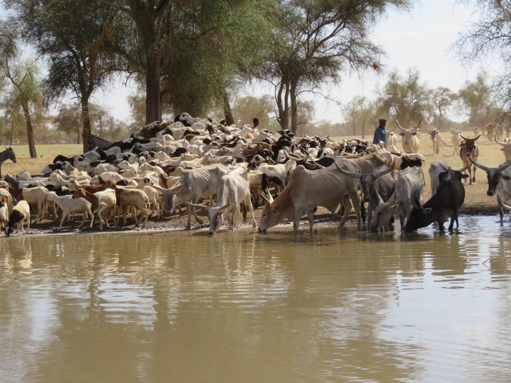

+++
# Date this page was created.
date = "2020-05-12"

# Project title.
title = "CaSSECS"

# Project summary to display on homepage.
summary = "Carbon Sequestration and greenhouse gas emissions in (agro) Sylvopastoral Ecosystems in the Sahelian CILSS States"

# Optional image to display on homepage (relative to `static/img/` folder).
image_preview = "featured.jpg"

# Tags: can be used for filtering projects.
# Example: `tags = ["FSPM", "FSPM"]`
tags = ["CO2", "STICS", "MAESPA", "DynACof"]

# Optional external URL for project (replaces project detail page).
# external_link = "https://www..."

# Does the project detail page use math formatting?
math = false
+++

CaSSECS - for *Carbon Sequestration and greenhouse gas emissions in (agro) Sylvopastoral Ecosystems in the Sahelian CILSS States* - aims at improving the assessment of carbon footprint of Sahelian agro-silvopastoral ecosystems to better quantify their impacts on climate change for the development of livestock policies adapted to the Sahel.

---

---

**Objectives of the project**: Improve the assessment of carbon
footprint of Sahelian agro-silvopastoral ecosystems in order to better
quantify their impacts on climate change for the development of
livestock policies adapted to the Sahel.

**Background**: The Paris Agreement has strengthened the global efforts
to fight climate change by requiring all countries to set climate
targets, particularly in terms of greenhouse gas (GHG) reduction.
According to the current estimation models, GHG emissions from ruminants
in (agro) pastoral systems represent a significant share of the total
GHG emissions in many developing countries and are expected to increase
in the coming decades. One of the major challenges of the CaSSECS
project is therefore to modify the vision of the negative impact of
(agro) pastoral livestock farming systems on the environment. More
specifically, it is about enabling (agro) pastoral farmers to continue
to live from their practices, by producing products and services and
having the ability to adapt and participate in the mitigation of climate
change effects. Undeniably, Sahelian (agro) pastoral livestock systems
(LS) are threatened, in particular because they are declared as
significant emitters of GHGs, due to insufficient data, repositories and
reliable scientific and technical skills.

**Aims:** The aim of the CaSSECS project is to help (agro) pastoralists to adopt practices to
improve their C footprint, while maintaining/improving the productivity
of production systems. Another objective is to make the technical agents
of the ministries competent and autonomous in the implementation of
reliable and rigorous devices for measuring the environmental impact of
LS. The project will provide the data necessary for a comprehensive trend analysis 
to the managers of the national inventory. Finally, the CaSSECS project lead the cabinets of ministries, 
professional livestock farmers' organisations, regional and international
organisations to mobilize all the products and induced changes.

The outputs of the CaSSECS project are: 

1. the inventory of mitigation practices,  
1. the provision of a pack of tested and validated good practices,  
1. adapted curricula,  
1. data and indicators,  
1. tools and methods,  
1. training materials, methodological guides for implementing the approach,  
1. positioning statements, Policy briefs and communication materials.  

To achieve the results, the CaSSECS project makes an initial
diagnosis of the existing practices and needs of livestock farmers, implements participatory 
experiments of "optimal" practices and resources, set up training for technical agents, develop
suitable programmes, tools and field devices for data collection and long-term monitoring, 
develop a contextualized model and an adapted information system, set up institutional dialogue, 
communicate and advocate on livestock and climate change.

**Main activities**: The main activities of CaSSECS project are: 

1. production of baseline data on GHG emissions and C sequestration
(evaluation of productivity and emissions linked to animals, evaluation
of the contribution of soil to the C footprint, evaluation of the
contribution of spontaneous vegetation to the C footprint),  
1. improvement of the assessment system on a national scale (mapping the
characteristics and dynamics of ecosystems, spatio-temporal modelling of
the distribution of livestock and their mobility, fodder assessment and
C footprint of agro-pastoral farming at the national level),  
1. co-design and dissemination of options to mitigate the impact of
livestock on CC (efficient improvements in animal ration, sustainable
management of resources at the territorial level, evaluation of
mitigation options),  
1. training and capacity building on the assessment of the environmental impact of LS (student training,
professional training).

**Implementing organizations:**  
- *Institut Sénégalais de Recherche Agricole* (ISRA),  
- *Université Cheikh Anta Diop de Dakar* (UCAD),  
- *Centre de Suivi Écologique* (CSE),  
- *Centre de coopération Internationale en Recherche Agronomique pour le Développement* (CIRAD),  
- *Institut de l'Environnement et de Recherches Agricoles* (INERA),  
- *Centre International de Recherche-Développement sur l\'Élevage en zone Subhumide* (CIRDES),  
- *Centre Régional Institution spécialisée du CILSS* (Agrhymet-CILSS),  
- *Institut de Recherche pour le Développement* (IRD),  
- *University of Copenhagen*,  
- *Université Catholique de Louvain* (UCL).

**Partners of the project:**  
- *Direction de l'élevage du Sénégal*,  
- *Réseau de Communication sur le Pastoralisme Antenne de l'Ouest* (Recopa),  
- *Association pour la Promotion de l'Élevage au Sahel et en Savane* (APESS),  
- *Institut national de recherche pour l'agriculture, l'alimentation et l'environnement* (INRAE),  
- *Centre national de la recherche scientifique* (CNRS),  
- *Université Paul Sabatier Toulouse III*,   
- *Lunds University*,  
- *Food and Agriculture Organisation of the United Nations* (FAO).  

**Other main stakeholders:** Pastoral and agro-pastoral households (women, young people) and their professional organizations, in the intervention area.

**Localisation:** Six Sahelian CILSS countries: Senegal, Burkina-Faso, Niger, Mali, Chad and Mauritania

**Funding and co-funding:** European Union

**Duration:** four (4) years; January 2020 - December 2023

