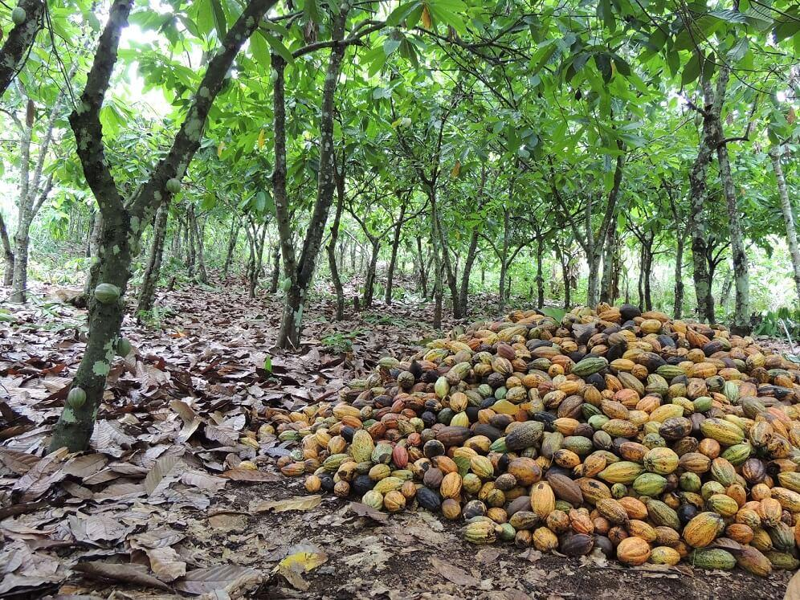

+++
# Date this page was created.
date = "2021-06-15"

# Project title.
title = "Cocoa4Future"

# Project summary to display on homepage.
summary = "Sustainability of production systems and new dynamics in the cocoa sector"

# Optional image to display on homepage (relative to `static/img/` folder).
image_preview = "featured.jpg"

# Tags: can be used for filtering projects.
# Example: `tags = ["FSPM", "FSPM"]`
tags = ["Cocoa", "FSPM", "ARCHIMED", "LiDAR"]

# Optional external URL for project (replaces project detail page).
# external_link = "https://www..."

# Does the project detail page use math formatting?
math = false
+++

The overall objective of Cocoa4Future is to enhance the sustainability of cocoa farms while preserving the environment by tailoring cocoa cropping systems to the changing context in Côte d'Ivoire and Ghana. Our aim is to contribute to the agroecological transition of cocoa production in these countries by proposing research that will help trigger a shift towards production systems that are in tune with environmental sustainability, economic sustainability, social responsibility, and quality standards, including ethical imperatives.

---

Implementing organization: CIRAD.

---

Region: Côte d’Ivoire and Ghana.

---

Total budget: € 7,000,000.

---

